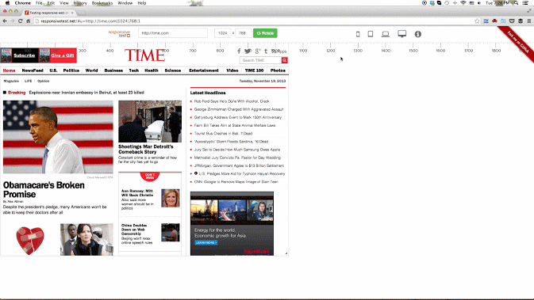

Самотестирование
================

Каждый раз перед передачей вёрстки на тест обязательно проверяем:

- Работоспособность билд версии (а не только дев)
- Отсутствие ошибок в консоли
- Пиксель-перфект
- Кроссбраузерность:

  - Chrome
  - Mozilla FF
  - IE (11, Edge)
  - Opera
  - Safari (если работаем на маке)
  - yandex браузер

- Если делается адаптив, то проверяем вёрстку в эмуляторе в хроме на последних айфоне, айпаде, самсунге.
  
Тестирование разрешений
=======================

- [Тестирование разрешений](https://github.com/nghuuphuoc/responsivetest)

